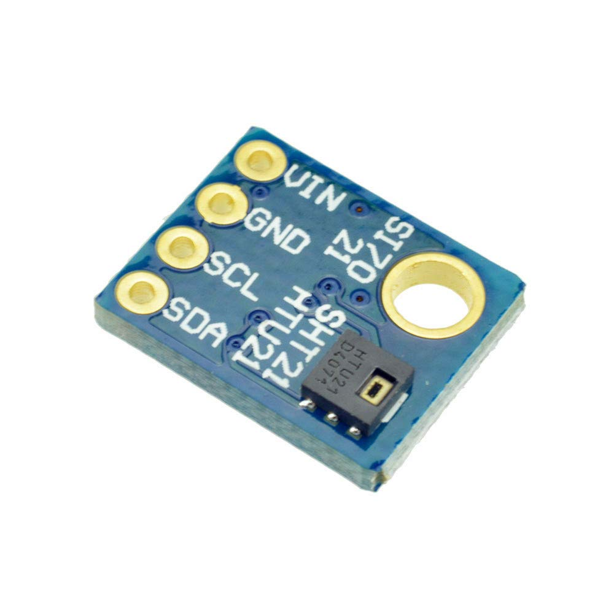

# SHT21_driver_stm32
Simple driver implemented in C for SHT21 using ST's STM32F401RE Nucleo board.

SHT21 is a temperature and humidity sensor.
The I2C bus is used to communicate with it.

  

The pin configuration is as follows:
- VCC - Supply
- GND - Ground
- SCL - I2C Clock
- SDA - I2C Data

Folders:
- **/Driver_code** folder for the driver implementation source code and more details.
- **/SHT21_example** folder there is an example that can be ported directly to STM32IDE.
- **/Doc** has the main manuals used for the MPU6050 and images for the Readme.

For now the current operations are supported:
- Read/Write operations on the I2C bus (generalised)
- Reading values from the temperature/humidity sensor
- Verify correct data reception (CRC check)
